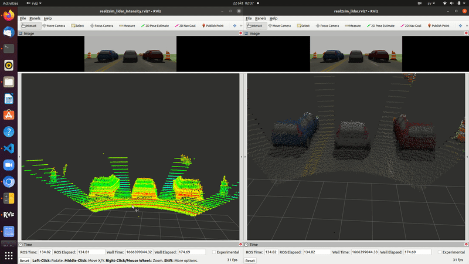

# Real2Sim_gazebo: Realistic Velodyne64E simulation
One of the main problems in AD/ADAS simulations in Automotive industry is that simulation is too much ideal and far from realistic and artifacts representation in different ADAS systems, further more it is hard to include such simulations in virtual validation cycles such as virtual SIL, or virtual HIL.

This repo is a demonstration for the presented ideas in these two papers:
    
- [End-to-end sensor modeling for LiDAR Point Cloud](https://arxiv.org/abs/1907.07748)
- [Learning to Predict Lidar Intensities](https://www.researchgate.net/publication/348850878_Learning_to_Predict_Lidar_Intensities)

Demonstrating a method of using DNN, to represent LiDAR sensor model in simulation environments, and how can we enhance this sensor model by using Camera LiDAR sensor fusion.

# Dependencies
- Opencv 4.4.0
- opencv_contrib

## Run the Demo
- copy the models in real2sim_lidar_sensor/models to ~/.gazebo/models
- catkin build  real2sim_lidar_sensor
- roslaunch real2sim_lidar_sensor  oponent_take_over_ego.launch
- Enjoy and test ;)

## Qualitative KPIs
This Demonstration presents a realistic Velodyne 64E simulation where we are representing LiDAR points intensities and it's variation with different materials and different colors by fusing LiDAR point cloud with Data annotation, and Front Camera.
Giving the DNN to create a lockup table to assign different artifacts to each point.

The above image shows the variation of intensities for three identical vehicles standing by the same distance but with different colors, giving different intensity distributions for the blue vehicle, grey vehicle, and red vehicle.

the above image shows that the Camera-LiDAR fusion helped to present realistic sensor model as well in non annotated classes.

## Quantitative KPIs

the above image shows the error historgram distribution in the training data, where the majority of the intensity error is on the left side(Zero), which is a good sign that there is no error in the predicted LiDAR artifacts.

Dnn scored L1 Score is 6.69%.

the above represents the intensity distribution from the real sensor vs the distribution of the inferred intensities from real sensor points, representing the accuracy of the DNN to estimate sensor artifacts with a reference.

This KPI was applied on validation data, and it scored 49.42%.

## Other Features
In this repo we are presenting as well Object Bounding box annotation, and point level annotation in Gazebo.

## Simulation environments this method can integrate with
This Demonstration can be integrated with any simulation environment such as:
- Unity.
- Unreal(carla).
- Carmaker.
- Gazebo.
- any other simulation environment.

## Sensors we can Simulate
This Demonstration can be applied on any LiDAR sensor:
- Velodyne.
- Ouster.
- Luminar.
- Benwake.
- Scala(Valeo).

## Future work
Real2Sim for Radar sensor.

## Contacts:
For knowlage transfer, buissness opportunities or other questions don't hesitate to reach out:

khalid.elmadawi@sigma.se
